# الإرشادات المنهجية لتنفيذ العمل المخبري رقم 1  

لتنفيذ هذا العمل المخبري، ستحتاج إلى [VS Code](https://code.visualstudio.com) أو [PyCharm Professional](https://www.jetbrains.com/pycharm/download/).

## إنشاء المشروع محليًا
مثال لـ PyCharm:`File -> New Project...`في قائمة **New Project...** اختر **Django**، حدد مسار المشروع في **Location** وأدخل اسم التطبيق في **Application name**.


## إنشاء المشروع على الجهاز الافتراضي (عن بُعد)
للاتصال بالجهاز الافتراضي وإنشاء المشروع عليه، اتبع الخطوات التالية:
- افتح VS Code وثبت إضافة **Remote Development**.

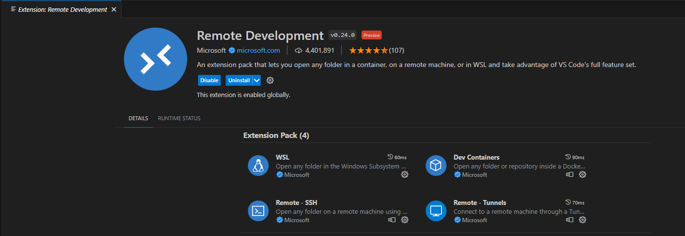

**ملاحظة: في هذه الخطوة، يجب أن يكون الجهاز الافتراضي مشغلاً بالفعل!**
- بعد تثبيت الإضافة، سيظهر رمز في الزاوية السفلية اليسرى، اضغط عليه.

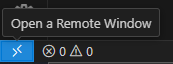

- اختر **Connect to Host...**

### كيفية معرفة IP الجهاز الافتراضي
أدخل الأمر **ifconfig** على الجهاز الافتراضي، وابحث عن واجهة Ethernet، في هذه الحالة - enp0s3، وراجع IP في السطر الثاني مقابل inet.يرجى ملاحظة أن نوع الاتصال في إعدادات "الشبكة" للجهاز الافتراضي يجب أن يكون مضبوطاً على "الجسر الشبكي" (Bridge Network).

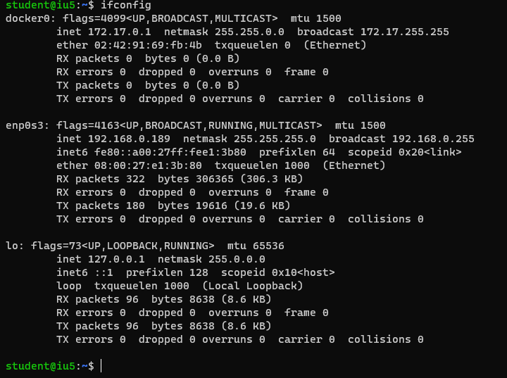

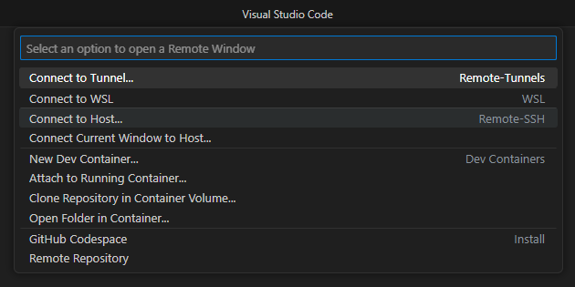

- ستكون صيغة الاتصال كالتالي - **user_name@remote_host_ip**

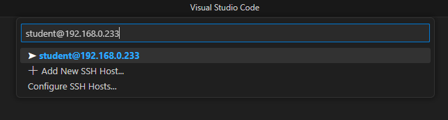

- في الخطوة التالية، حدد المكان الذي سيتم وضع مشروعك فيه. يُفضل إنشاء دليل مخصص للمشاريع، على سبيل المثال **pythonProjects**.

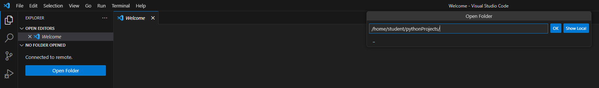

- اضغط على **OK** وأدخل كلمة المرور.
- إذا تم الاتصال بنجاح، ستظهر النتيجة التالية:

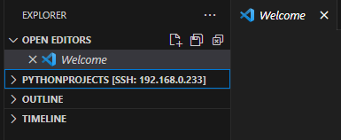

### إنشاء مشروع Django
- أنشئ مجلدًا بالاسم المطلوب للمشروع وانتقل إليه.

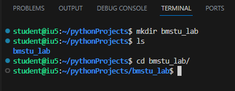

- أنشئ بيئة افتراضية باستخدام أداة **venv** وقم بتفعيلها.

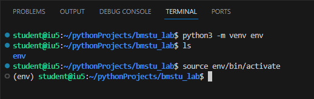

- بعد تفعيل البيئة الافتراضية، قم بتثبيت Django (في وقت كتابة هذا الدليل، النسخة المتاحة هي 4.2.4).

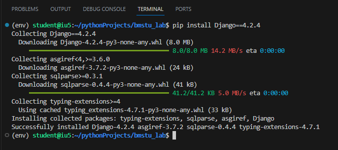

- أنشئ المشروع باستخدام الأمر `django-admin startproject <your_project_name> .`

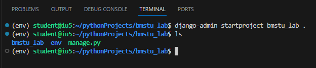

- بعد إنشاء المشروع، انتقل إلى ملف **settings.py** وأضف علامة النجمة **\*** إلى **ALLOWED_HOSTS**.

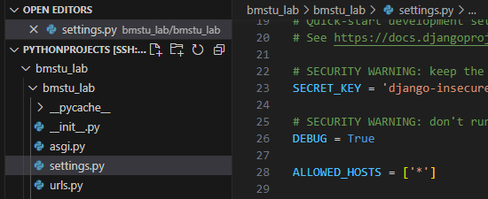

- شغّل المشروع باستخدام الأمر `python manage.py runserver 0.0.0.0:8000`    **ملاحظة:** لتكون الخدمة متاحة من النظام الأساسي، يجب تشغيلها على عنوان البث **0.0.0.0**. يمكن أن يكون المنفذ أي رقم، وفي هذه الحالة هو 8000.

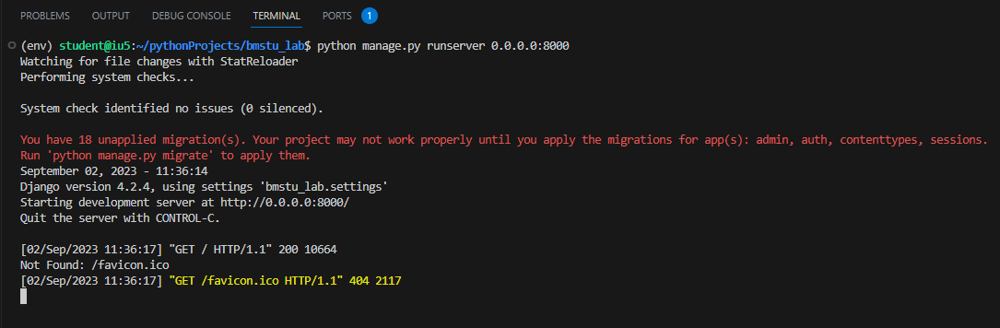

- أجرِ طلبًا من النظام الأساسي، وذلك بإدخال عنوان الجهاز الافتراضي + المنفذ الذي حددته عند تشغيل المشروع في المتصفح.

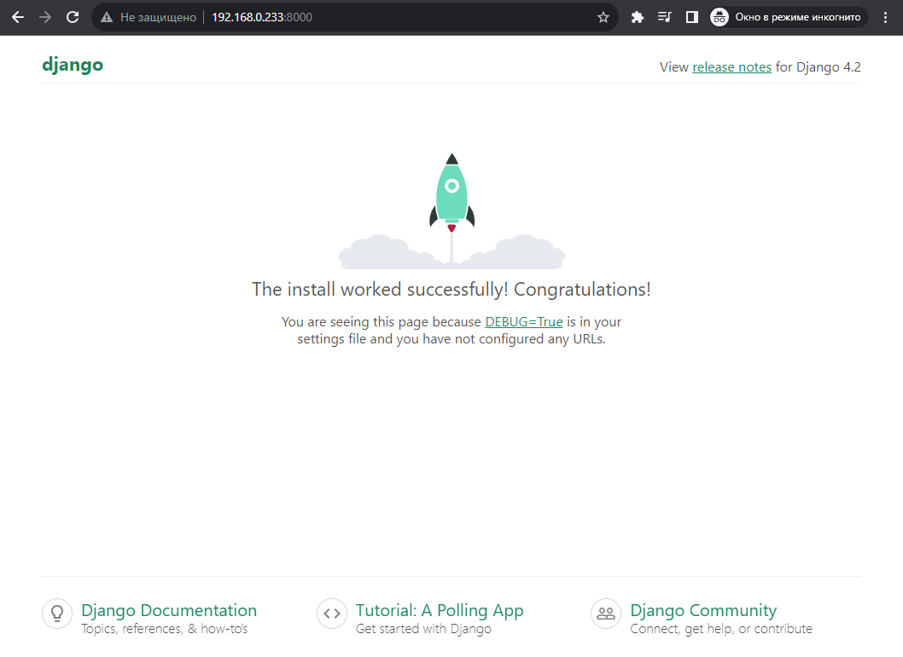

باقي العمل يُنفذ بنفس الطريقة كما في الجهاز الأساسي.


هيكل المشروع
في مجلد المشروع bmstu:

settings.py - إعدادات المشروع، يمكن أن يحتوي المشروع على عدة تطبيقات.
urls.py - مطابقة الروابط مع المعالجات (views).
في حزمة bmstu_lab:

views - معالجات التطبيق.
templates - مجلد القوالب (ملفات HTML).


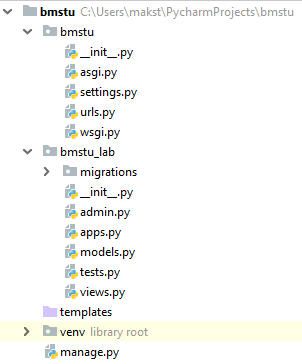

تشغيل التطبيق
اضغط على زر Run في القائمة اليمنى لتشغيل التطبيق.


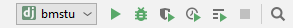

في هذه الحالة، يجب أن تعرض وحدة التحكم سجل تتبع حول التطبيق الذي يعمل على **localhost** على المنفذ **:8000**


يجب أن تظهر الصفحة القياسية لتطبيق Django في المتصفح على العنوان `http://127.0.0.1:8000/`.


## كيفية العمل مع View وUrls
`views.py`
```python
from django.http import HttpResponse

def hello(request):
    return HttpResponse('Hello world!')
```

`urls.py`
```python
from bmstu_lab import views

urlpatterns = [
    path('admin/', admin.site.urls),
    path('hello/', views.hello),
]
```

بعد تشغيل الخادم على المسار `http://127.0.0.1:8000/hello/` يجب أن ترى


وبالتالي، سيتم استدعاء كود **hello** عند الوصول إلى الخادم عبر URL **/hello**.

## القوالب

القالب هو ملف نصي عادي، وغالبًا ما يكون بتنسيق HTML، يحتوي على متغيرات وعلامات.
يتم استبدال هذه التركيبات أثناء عرض القالب بالبيانات التي يقدمها المستخدم كمعلمات للقالب. 
في النهاية، نحصل على ملف HTML يمكن عرضه في متصفح المستخدم.

للشروع، سنقوم بتقديم صفحة HTML ثابتة للمستخدم، ولن تحتوي على أي تركيبات من نظام القوالب.

لننشئ ملف HTML في الدليل ‘templates’.


`index.html`
```html
<!doctype html>
<html lang="en" class="h-100">
<head>
  <meta charset="utf-8">
    <title>BMSTU</title>
</head>
<body>
    Hello BMSTU students!
</body>
</html>
```

Чтобы указать Django на то, где искать наши шаблоны проверьте файл `settings.py`. В нем в переменной `TEMPLATES` в поле `DIRS` должен быть указан путь к вашим шаблонам 

```python
TEMPLATES = [
    {
        # ...
        "DIRS": [BASE_DIR / "bmstu_lab/templates"],
        # ...
    },
]
```

Чтобы вернуть пользователю созданный файл, используйте метод render.
Например данный код возвращает страницу `index.html`, которая была создана в
папке templates.

`views.py`
```python
from django.shortcuts import render

def hello(request):
    return render(request, 'index.html')
```

После запуска сервера по пути `http://127.0.0.1:8000/hello/` вы должны увидеть


## Переменные в шаблонизации

В шаблоне переменная имеет вид: `{{ some_variable }}`. Когда шаблонизатор
рендерит страницу и находит переменную, то вместо нее он подставляет результат,
который вычисляется в этой переменной. 

Добавим в статичную страницу переменные.

`index.html`
```html
<!doctype html>
<html lang="en" class="h-100">
<head>
  <meta charset="utf-8">
    <title>BMSTU</title>
</head>
<body>
    Hello BMSTU students!
    Today is {{ current_date }}
</body>
</html>
```

Чтобы передать значение переменной из кода:

`views.py`
```python
from datetime import date

def hello(request):
    return render(request, 'index.html', {
        'current_date': date.today()
    })
```

Если значение переменной не было передано, то она будет заменена пустой
строкой. В именах переменных не может быть пробелов или знаков препинания.

После запуска сервера по пути `http://127.0.0.1:8000/hello/` вы должны увидеть

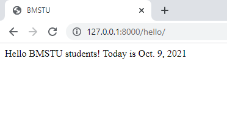

В качестве переменной может быть словарь, тогда к вложенным полям можно
обращаться через точку.

```python
def hello(request):
    return render(request, 'index.html', { 'data' : {'current_date': date.today()}})
```

```python
    Today is {{ data.current_date }}
```

## Теги в шаблонизации

В шаблоне теги выглядят как ``. С помощью тегов можно реализовывать
условия, циклы, свою логику. Большинство тегов должны закрываться:
` content `

Допустим, нам нужно вывести список элементов. Для этого воспользуемся ``

`index.html`
```html
<!doctype html>
<html lang="en" class="h-100">
<head>
  <meta charset="utf-8">
    <title>BMSTU</title>
</head>
<body>
    Hello BMSTU students!
    Today is {{ data.current_date }}
<ul>
    
        <li>We like {{ var }}</li>
    
</ul>
</body>
</html>
```

`views.py`
```python
from datetime import date

def hello(request):
    return render(request, 'index.html', { 'data' : {
        'current_date': date.today(),
        'list': ['python', 'django', 'html']
    }})
```

После запуска сервера по пути `http://127.0.0.1:8000/hello/` вы должны увидеть

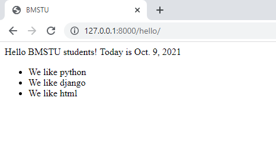

**for** итерируется по списку, доступ к элементам можно получать через
созданную переменную, в данном случае `var`.

`` позволяет выводить содержимое блока, если значение переменной
“true” (или значение существует, либо если список и он не пустой)
Вместе с этим тегом можно использовать ``, ``

`index.html`
```html
<ul>
    
        
            <li>We like {{ var }}</li>
        
            <li>We like {{ var }} a lot!</li>
        
            <li>We do not like {{ var }}</li>
        
    
</ul>
```

После запуска сервера по пути `http://127.0.0.1:8000/hello/` вы должны увидеть


В теге **if** можно использовать:
- and
- or
- not
- операторы сравнения
- in (проверка что значение существует в списке)

## Наследование шаблонов

Наследование шаблонов позволяет создать основной шаблон, который
содержит общие элементы, а частные места будут переопределять наследники.
Места, которые могут быть переопределены помечаются тегами ``

Допустим, есть базовый шаблон `base.html`:

`base.html`
```html
<!doctype html>
<html lang="en" class="h-100">
<head>
  <meta charset="utf-8">
    <title></title>
</head>
<body>
    Hello BMSTU students!
    
</body>
</html>
```

Здесь определена часть, которая будет присутствовать у нас на каждой
странице, которая наследуется от него.
Создадим наследника `orders.html`, который будет выводить список заказов:

`orders.html`
```html


Список заказов


<ul>
    
        <li><a href="">{{ order.title }}</a> </li>
    
        <li>Список пуст</li>
    
</ul>

```

`views.py`
```python
def GetOrders(request):
    return render(request, 'orders.html', {'data' : {
        'current_date': date.today(),
        'orders': [
            {'title': 'Книга с картинками', 'id': 1},
            {'title': 'Бутылка с водой', 'id': 2},
            {'title': 'Коврик для мышки', 'id': 3},
        ]
    }})
```

Для каждого товара добавили ссылку на его отдельную с траницу в формате ``

В файле `urls.py`необходимо определить url с именем ‘order_url’, который будет
принимать id заказа:

`urls.py`
```python
urlpatterns = [
    path('admin/', admin.site.urls),
    path('', views.GetOrders),
    path('order/<int:id>/', views.GetOrder, name='order_url'),
]
```

Создадим шаблон для страницы товара `order.html` и ее view

`order.html`
```html


Заказ №{{ data.id }}


    <div>Информация о заказе №{{ data.id }}</div>

```

`views.py`
```python
def GetOrder(request, id):
    return render(request, 'order.html', {'data' : {
        'current_date': date.today(),
        'id': id
    }})
```

После запуска сервера по пути `http://127.0.0.1:8000/` вы должны увидеть

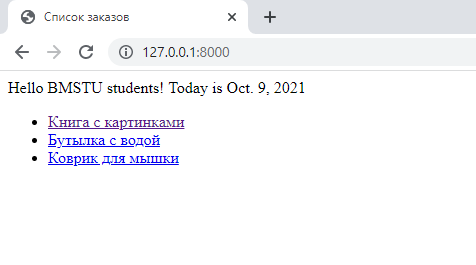

По пути `http://127.0.0.1:8000/order/2` вы должны увидеть

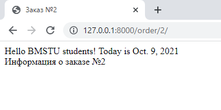

## Include в шаблонизации

Позволяет рендерить в месте использования тега другой шаблон

`orders.html`
```html


Список заказов


<ul>
    
       
    
        <li>Список пуст</li>
    
</ul>

```

`order_element.html`
```html
 <li><a href="">{{ element.title }}</a> </li>
```

**with** - позволяет сменить контекст. Т.е. в шаблоне `order_element.html` будут доступны не только *order*, *orders* , но и *element*

## Подключение статических файлов

В `settings.py` указан путь до статических файлов
```python
STATIC_URL = '/bmstu_lab/static/'
```

```python
STATICFILES_DIRS = [
    BASE_DIR / "static",
]
```

В приложении создаем папку и кладем туда файлы:

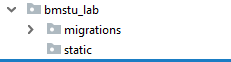

Файлы `.css` кладем в отдельную папку `static/css` 

Перед использованием ссылки на статический файл, в шаблоне:
```html

```

Используем ссылку:
```html
<link rel="stylesheet" type="text/css" href="">
```

Пример `.css`
```css
.order-text {
  font-size: 40px;
}
```

Пример шаблона с `css`

```html
<div class="order-text">Информация о заказе №{{ data.id }}</div>
```

## Получение данных из запроса, input

Для передачи данных из браузера на сервер Django, необходимо добавить форму, кнопку и поле ввода в наш шаблон
```html
<form action="sendText" method="post" enctype="multipart/form-data">
    
    <input name="text" type="text"><br><br>
    <input type="submit" value="Submit" >
</form>
```

Добавить в `urls.py` обработчик нашего POST-запроса `views.sendText` для url [/sendText]()
```python
path('sendText', views.sendText, name='sendText'),
```

А в обработчик `sendText` в `views.py` добавляем код получения значения передаваемого параметра из POST-запроса

```python
def sendText(request):
    input_text = request.POST['text']
    ...
```
